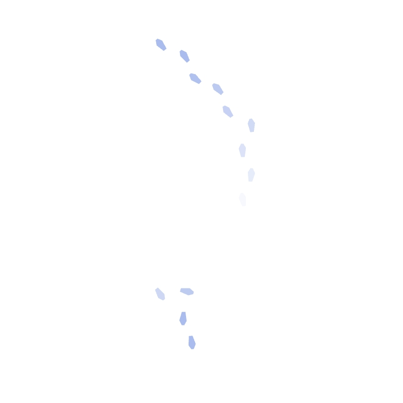

# Footsteps
WCC2 – Sketch 02  
Author: Haiyi Xiao  
Date: Feb 2026  

## Short Description
Footsteps is a mobile-based interactive sketch where participants use device tilt to create footprints on a shared snowy ground. As multiple users move at the same time, the work builds an accumulating field of footprints that gradually fade away.

## Concept / Intent
This sketch explores the feeling of multiple people walking around on snow and leaving temporary traces behind. By tilting a mobile device, each participant generates pairs of footprints that appear, overlap, and slowly disappear. The focus is less on realistic simulation and more on creating a simple shared experience of movement, presence, and trace-making.

## Technology Used
- p5.js
- JavaScript
- Socket.IO
- HTML / CSS
- Mobile device motion / orientation input

## How to Run / Install
### Online Version
1. Open the project on a mobile device:  
   https://footsteps-9ydb.onrender.com
2. If you are using an Apple device, tap the **Permission** button to allow motion access.
3. Tilt the device to move the footsteps.

### Local Version
1. Clone or download this repository.
2. Install dependencies with `npm install`.
3. Start the server with `node app.js`.
4. Open the local address in a browser on your mobile device.

## Requirements
### Hardware
- Mobile device (phone or tablet)

### Software
- Modern mobile browser
- Internet connection for the online shared version

## Screenshots / Media

## Credits / Acknowledgements
Created by Haiyi Xiao.

Inspired by:
- **Simpler Hello World Web Sockets** by Becky Aston (from WCC2 Week 3 examples)
- **MobileDeviceOrientation** by Becky Aston (from WCC2 Week 3 examples)  
  https://editor.p5js.org/beckyaston/sketches/5wtxAxSpZ
- **Gesture-gestural_drawing** by Becky Aston (from WCC1 Week 6 examples)

ChatGPT (OpenAI) was used as a coding assistant during development, particularly for frame-rate optimisation, screen orientation correction across different devices, socket-based synchronisation logic, and code cleanup / organisation. All creative decisions, interaction design, visual direction, and conceptual development were made by the author.

## License
This project is shared for educational and non-commercial purposes.

## Contact / Links
- GitHub Repository: https://github.com/XamnerX/footsteps
- Live Demo (Render): https://footsteps-9ydb.onrender.com